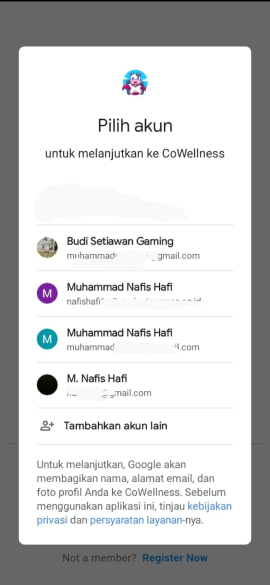

# CoWellness

CoWellness adalah aplikasi berbasis mobile platform untuk mengakomodasi para peternak sapi dalam memantau kebutuhan serta kesehatan sapi. Pemantauan yang berkaitan dengan kebutuhan sapi dilakukan dengan fitur takaran pangan sapi, serta fitur pengingat (Reminder) untuk waktu pemberian pangan. Kami menyediakan fitur artikel yang menjabarkan jenis-jenis penyakit pada sapi, serta ciri-ciri sapi terjangkit penyakit tersebut. Selain itu, sebagai tindak pencegahan terhadap merebaknya penyakit pada sapi, kami membuat fitur Drop Point. Fitur Drop Point merupakan fitur yang menampilkan pusat pengolahan limbah kotoran sapi terdekat yang dapat dijangkau oleh para peternak. Untuk lebih menekankan kenyamanan para peternak dalam aplikasi yang kami rancang, kami juga menambahkan fitur forum diskusi yang dimana para peternak dapat berinteraksi antar satu sama lain, sehingga mereka dapat berbagi informasi yang dapat menambah pengetahuan baru bagi mereka.
## Features

- Takaran nutrisi pangan sapi
- Reminder pemberi pakan dan vitamin
- Drop point limbah sapi
- Artikel tentang sapi
- Forum diskusi peternak

## Tech Stack

**Flutter** - framework

**Firebase** - real-time data management and storage

**Figma** - UI and UX design

## Screenshots

* **Login & Register**

