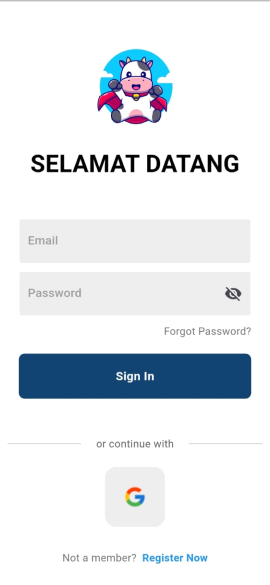
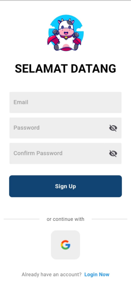
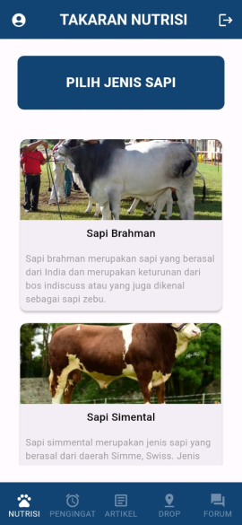
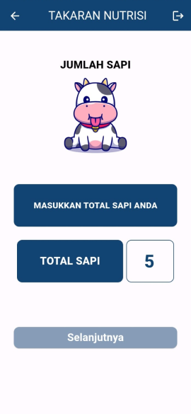
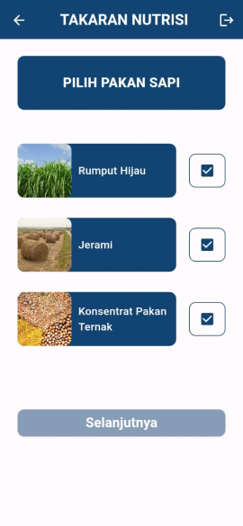
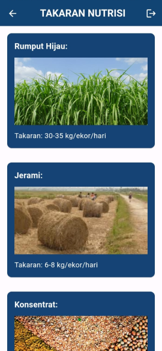
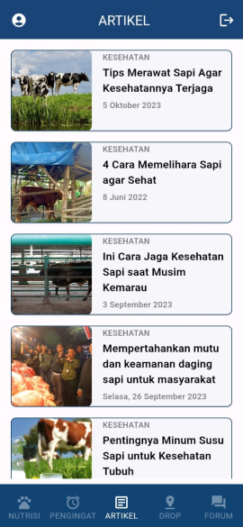
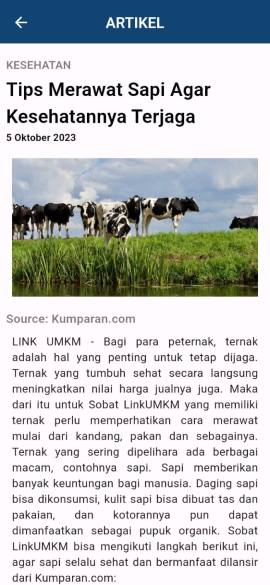
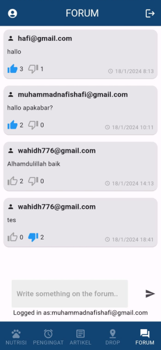

# CoWellness


**CoWellness** is a mobile application designed to assist cattle farmers in monitoring the needs and health of their cattle. The app features a nutrition calculator for cattle feed and a reminder system for feeding times. We also provide informative articles detailing various cattle diseases and their symptoms. To prevent the spread of diseases, the app includes a Drop Point feature that shows the nearest cattle waste processing centers. Additionally, we've incorporated a discussion forum to enhance the user experience, allowing farmers to interact and share valuable information with each other.

## Features

- **Cattle Nutrition Calculator:** Easily measure the right amount of nutrients for your cattle.
- **Feeding and Vitamin Reminders:** Never miss a feeding or supplement schedule.
- **Waste Drop Points:** Locate nearby cattle waste processing centers.
- **Informative Articles:** Learn about cattle diseases and health tips.
- **Discussion Forum:** Connect and share knowledge with fellow farmers.

## Tech Stack

- **Flutter:** Framework for building the app.
- **Firebase:** Real-time data management and storage.
- **Figma:** UI and UX design.

## Screenshots

### Login & Register

The login and registration features are integrated with Firebase and support Google login.





### Nutrition Calculator

This feature helps farmers easily calculate the appropriate nutrients and vitamins for their cattle.






### Articles

Access articles detailing various cattle diseases, their symptoms, and health tips.




### Forum

The discussion forum allows farmers to interact and share information, fostering a community of knowledge exchange.



## Getting Started

### Prerequisites
- **Flutter SDK:** Make sure you have Flutter installed on your machine. You can download it from [flutter.dev](https://flutter.dev).
- **Firebase Account:** Set up a Firebase project for authentication and database services.

### Installation

1. Clone the repository:
    ```bash
    git clone https://github.com/whdhdyt21/CoWellness.git
    ```
2. Navigate to the project directory:
    ```bash
    cd CoWellness
    ```

3. Install the required dependencies:
    ```bash
    flutter pub get
    ```

4. Set up Firebase:
    - Follow the instructions on the Firebase Console to add your app.
    - Download the `google-services.json` file for Android and place it in the `android/app` directory.
    - Download the `GoogleService-Info.plist` file for iOS and place it in the `ios/Runner` directory.

### Running the App

To run the app on an emulator or a physical device, use the following command:
```bash
flutter run
```

## Contributing

Contributions are welcome! Please fork this repository and submit a pull request for any enhancements or bug fixes.

1. Fork the repository.
2. Create a new branch (`git checkout -b feature/your-feature`).
3. Commit your changes (`git commit -am 'Add new feature'`).
4. Push to the branch (`git push origin feature/your-feature`).
5. Create a new Pull Request.

## Acknowledgements

Thanks to everyone who has contributed to this project and helped improve it.

---

**Hackfest 2024 - CoDify Team**

- **Wahid Hidayat** (Hacker)
- **Muhammad Nafis Hafi** (Hacker)
- **Puan Bening Pastika** (Hustler)
- **Muhammad Rizki Irawan Wijaya** (Hipster)

---

Feel free to customize this README according to your specific requirements and repository structure.
